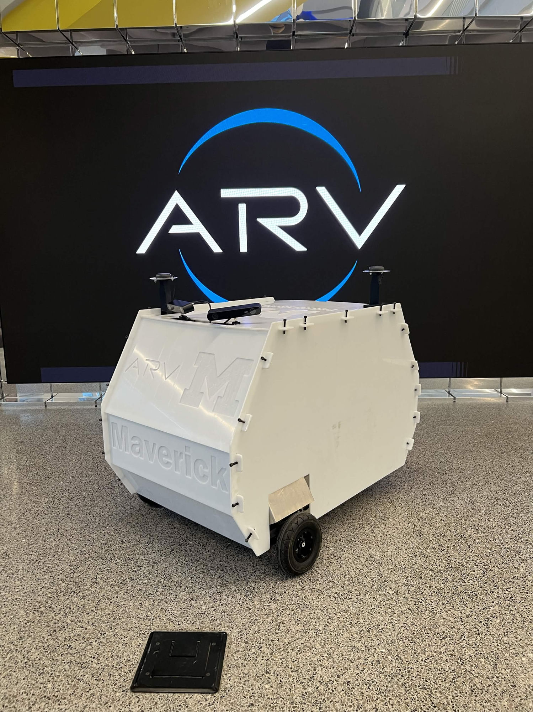

# UMARV Maverick 2025-2026


## `src/` Layout
| Category | Contents |
|---|---|
| `bringup` | Launch files, mode/course configs, and the top-level entry points for running the stack |
| `core` | Shared messages and library code used across packages |
| `description` | URDFs and robot/world description packages |
| `hardware` | Drivers for onboard hardware |
| `localization` | Odometry and coordinate-frame conversion packages |
| `navigation` | Path planning, path tracking, mission control, and recovery behavior packages |
| `simulation` | Simulated sensors and environment for testing without hardware |
| `visualization` | Visualization packages |
| `template` | Package skeletons copied by `just create-package` |

## Setup
First run the [host bootstrap](https://github.com/umigv/nav-environment) if you haven't. Then:
```bash
just setup
```

VSCode: Install recommended extensions in this repo (it should automatically prompt you).

## Commands
```bash
# See available commands
just
```

## Running the Stack
```bash
# Build the workspace
just build

# Build a single package including dependencies
just build-pkg <package>
```

Run each of these commands in separate terminals:
```bash
ros2 launch bringup base.launch.py mode:=<mode> [simulation:=true] [course:=<course>]
```
```bash
ros2 launch bringup teleop.launch.py controller:=<xbox/xbox_wireless/ps4/ps4_wireless>
```
and / or
```bash
ros2 launch bringup navigation.launch.py mode:=<mode> [course:=<course>]
```

### Mode and Course Configuration
See [bringup/README.md](src/bringup/README.md) for mode and course configuration details.

### Visualization
Run in a separate terminal:
```bash
ros2 launch bringup visualization.launch.py
```
This sends robot data to Foxglove. Then open [Foxglove Studio](https://foxglove.dev/download) and connect to `ws://localhost:8765`.

Alternatively, run RViz in a new terminal with the shared stack configuration:
```bash
just rviz
```
See [bringup/README.md](src/bringup/README.md) for which displays are enabled by default. If RViz asks to save the config on exit, decline - saving rewrites the shared config in RViz's verbose format. Keep personal tweaks in your own copy via File > Save Config As.

> **WSL:** set Windows display scaling to a whole-number percentage (e.g. 100%, 200%). Fractional scaling (e.g. 125%,
> 150%) isn't supported by WSLg and silently falls back to 100%, leaving rviz2's UI illegibly tiny.
> TODO: See [microsoft/wslg#23](https://github.com/microsoft/wslg/issues/23).

### Tmux

A tmux configuration is included to avoid creating too many terminals.

```bash
# Runs rviz and divides terminal into panes in which to run the launch commands
just tmux
```

To exit, close the window by pressing the prefix key (Ctrl + B) and then `&` (Shift + 7), and then confirming by typing `y` and pressing Enter. A convenient cheatsheet for other tmux usage can be found at [tmuxcheatsheet.com](https://tmuxcheatsheet.com).


## Testing
```bash
# Run all tests
just test

# Run tests for a single package
just test-pkg <package>
```

## Formatting & Linting
```bash
# Check formatting and lint
just lint

# Auto-fix formatting
just format
```

## Adding a New Package
```bash
just create-package <dir> <package> [python|cpp]
```
Copies [`template_python`](src/template/template_python) or [`template_cpp`](src/template/template_cpp) into `<dir>/<package>`.
