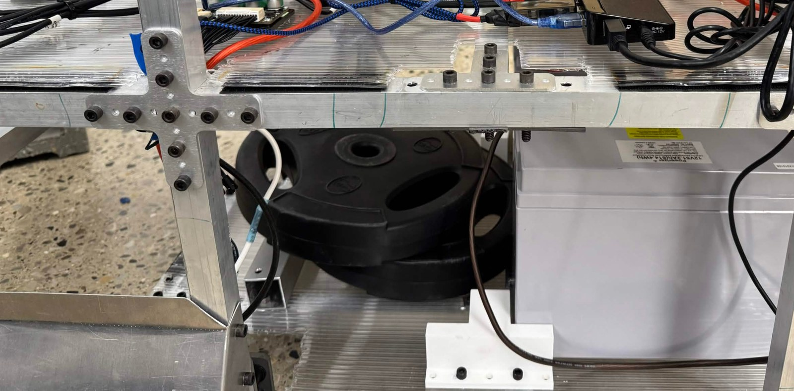
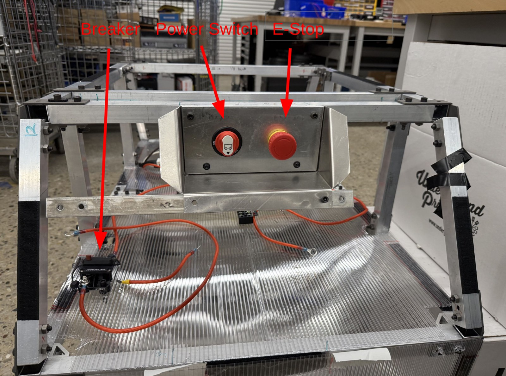
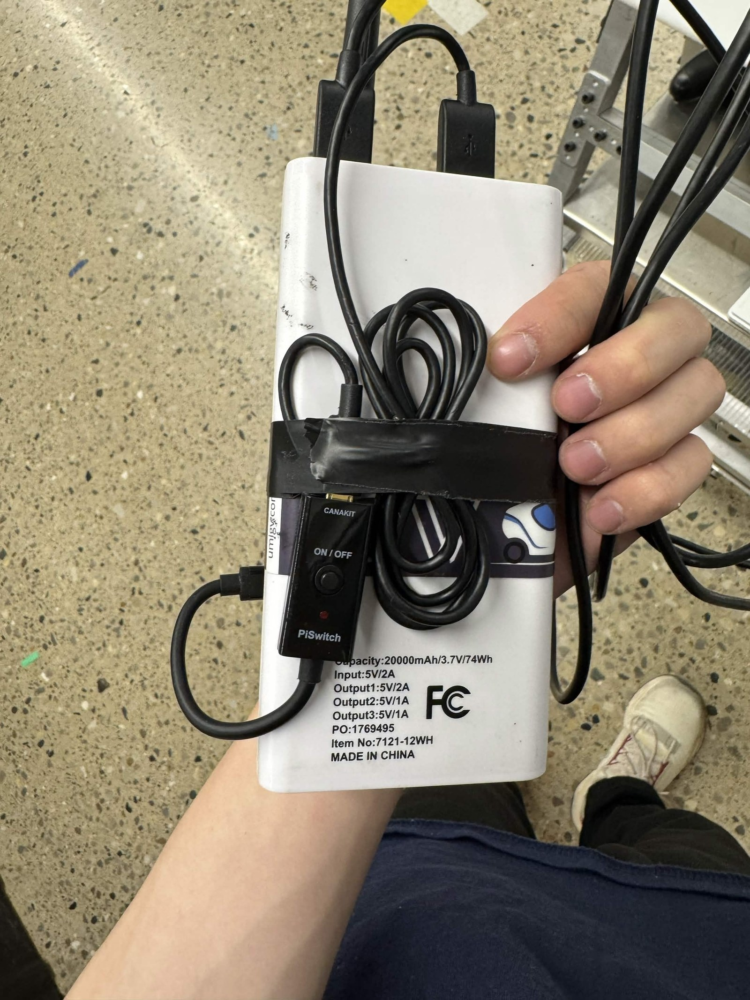
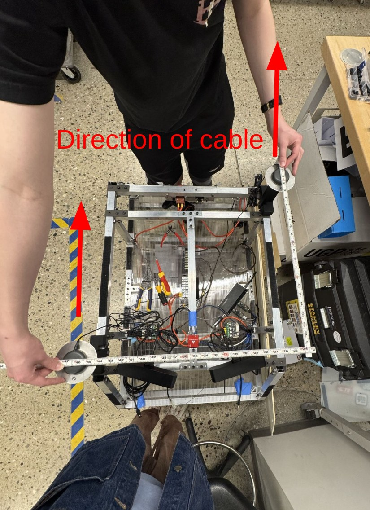

# Playbook

How to operate the physical robot on a test or competition day. Everything runs directly on a laptop mounted on the robot.

## Field day sequence

1. [Mech prep](#mech-prep).
2. [Power on](#power-system-and-wiring): motor power switch on, breaker engaged, laptop power bank on.
3. Turn on the [remote e-stop](#remote-e-stop).
4. [Calibrate the motors](#odrive).
5. Wait for GPS startup: run `just vectornav-monitor` to watch INS and GNSS status live (see [vectornav_driver/README.md](../src/hardware/vectornav_driver/README.md)).
6. [Record the GPS datum](#course-setup) with the robot stationary at the start position.
7. Launch the stack (see [README](../README.md) for commands and modes).
8. Record rosbags as needed with `ros2 bag record --all` (see [Post-run](#post-run) for naming and upload).

## What to bring

- LiPO batteries
- Laptop and chargers
- Power banks and chargers
- Remote e-stop
- Chair
- Isopropyl alcohol and cloth
- A wifi source (e.g. hotspot)
- PS4 controller
- Test obstacles
- Tools for quick repairs

For comp additionally:

- A prepped replacement for every key part on the robot
- Aluminum extrusion, fastener joints, and power tools like table saw and drill for rapid prototyping on-site
- Umbrella for shade for the laptop screen
- Sunscreen - comp days are long hours in direct sun

## Course setup

Courses live in `src/bringup/courses/` - one subfolder per course, selected with the `course:=` launch argument; see [bringup/README.md](../src/bringup/README.md) for the schema.

On real runs only `gps.json` (GPS datum and waypoints) is used, so that is what needs to be filled out at a new site. The datum is recorded on-site: with the robot stationary at the start position, run `ros2 launch bringup gps_origin_calculator.launch.py course:=<course>` - it writes the datum into the course's `gps.json` and shuts down automatically.

Competition waypoints are handed out in packed DMS format: store them verbatim in `waypoints/dms/` and run `just convert-waypoints` to generate the decimal-degree versions that go into `gps.json` - see [waypoints/README.md](../waypoints/README.md) for the format and workflow.

`map.json` is only the simulation obstacle map, created with the [course creation tool](https://github.com/umigv/course_creation_tool) - it isn't needed for real runs.

## Mech prep

- Check for loose screws. If any are loose, add a lock washer.
- Lube the gearbox with dry lube outside if it is not smooth.
- Wipe the wheels down with isopropyl alcohol before running to ensure consistent wheel friction.
- Make sure the wheel shield isn't scraping the wheel. If the wheel is caving, check whether the gearbox plate is bent.
- The payload is 25 pounds of gym weights mounted on the bottom of the robot. 
- Run the robot in the same configuration as it runs at comp, including wiring, payload, and weight. After any physical change (cable management, remounting), test again before it counts. At IGVC 2026 we moved the USB hub cable right beside the GPS receiver cable without retesting. This impacted signal strength and took us 3 days to diagnose.
- Before heading outside, make sure what you want to test is actually ready. Setup eats a ton of time, and warm testing weather is precious.

## Power system and wiring

- There are two sources of power: the LiPO batteries for the motors, and the Anker / Jackery power bank for the laptop (which powers all the USB devices).
- The Anker lasts longer and charges faster than the Jackery, so prioritize the Anker, but make sure the other is charging while you use one.
- The motor power system has a breaker, an e-stop, and a power switch. The power switch needs to be on and the breaker engaged. 
- The LiPO should generally never run out of battery given it has 500+ hours of battery life. Download "LiFePO4 Power" on your phone to monitor the current battery percentage.
- Everything on the robot, especially wiring, should be labeled such that when facing forward, the left (port) side is red and the right (starboard) side is green.

## Remote e-stop

- The remote e-stop is connected to a power bank. The cable has a power switch on the back. 
- To turn on: make sure the power switch is on, then turn on the power bank.
- To turn off: turn off the power switch on the back.

## ODrive

- Calibrate the motors with `just calibrate-odrive` before running. You don't need to recalibrate unless you unplug USB and turn off the main power (e-stop is fine).
- Configuration is done through the [web GUI](https://gui.odriverobotics.com/#/dashboard).
- [API docs](https://docs.odriverobotics.com/v/latest/fibre_types/com_odriverobotics_ODrive.html)
- Support contact: info@odriverobotics.com

## VN300

- The antenna cables should point in the same direction when mounted or the attitude reading may not converge. 
- The antennas are screwed onto the ground plane using plastic screws in the electrical box.
- Use the Milwaukee folding ruler to measure the offsets between the sensors. The measured offsets go into the URDF as the sensor offset constants (base->IMU, IMU->GNSS A, GNSS A->GNSS B) in [maverick_description/urdf/constants.xacro](../src/description/maverick_description/urdf/constants.xacro); at startup the [vectornav driver](../src/hardware/vectornav_driver/README.md) reads the resulting TF and writes the offsets to the sensor.
- Documentation PDFs are on Dropbox.
- Support contact: support@vectornav.com or +1 (512) 772-3615

## Controller pairing

- Wired: plug the controller in over USB and launch teleop with `controller:=ps4`.
- Bluetooth: hold Share + PlayStation until the light bar flashes to enter pairing mode, then pair it in the Bluetooth settings panel. Then launch teleop with `controller:=ps4_wireless`.

## Device aliases

Hardware configs refer to devices by stable paths (`/dev/vn300`, `/dev/estop`, `/dev/led`) instead of raw `/dev/ttyUSB*` names that change between boots. On a new laptop, plug in each device and create its alias once:

```bash
just alias /dev/ttyUSB0 vn300
```

The alias is a udev rule keyed to the device's USB vendor/product/serial, so it survives replugging and reboots. `just unalias <name>` removes one.

## Software practices

- Use light mode when it's bright outside - easier to see.
- Code changes go on the shared test-day branch and get sorted into PRs afterwards - see [CONTRIBUTING.md](CONTRIBUTING.md#branches). Do this per test day so the pile of unmerged changes doesn't explode.

## Post-run

- Turn off the motor power switch so the LiPO doesn't drain. Put both power banks on charge.
- Upload rosbags to Dropbox at the end of the day. Name them so people can tell what they are. Delete useless rosbags, and don't commit them to the repo.
- File a GitHub issue for anything that broke or acted weird while it's fresh (see [CONTRIBUTING.md](CONTRIBUTING.md#issues)).

## Troubleshooting

When things go wrong: suspect hardware more than you think (consider what is different vs simulation), and when investigating a regression, go through everything that changed since it last worked.

**ODrive says the e-stop is engaged but it isn't.** Check the wiring across the system, starting with the power connections - something likely came loose.

**ODrive hits the current limit.** Lube the gearbox if unlubed for a while and reduce kp on the ODrive - both lower the torque needed to drive the gearbox, which reduces current.

**Odometry is off / robot goes crazy on a simple turn at high speed.** Suspect wheel slip - it's hard to diagnose and happens when the robot moves, accelerates, or turns too fast. Wipe the wheels with isopropyl and lower the speed. Consider the floor's coefficient of friction when testing (asphalt > cement > marble).

**Robot doesn't follow paths precisely.** Likely inertia - the controllers may need retuning. Note that weight changes affect path tracking tuning, and gear ratio or wheel diameter changes affect odometry, so physical changes to the platform mean software retuning.

**GPS fix is bad or satellite count drops.** Run `just vectornav-monitor` to see the decoded INS and GNSS status. The VN300 antenna is sensitive to USB 3.0 EMI - this is an ongoing problem to be fixed. Make sure nothing running USB 3.0 (ZED camera, USB hub) is close to the antenna cables; move them physically as far apart as possible. Elevating the receivers also improves signal.

**ZED camera initialization fails or frames are intermittent.** - Check the cable's connection to the back of the camera. The screws need to be absolutely tight.

**ZED camera is inaccurate after autocalibration.** - Retry with a scene with more detail. Being too close to an object or seeing only empty space may inhibit its accuracy.
