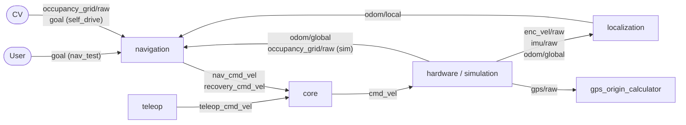
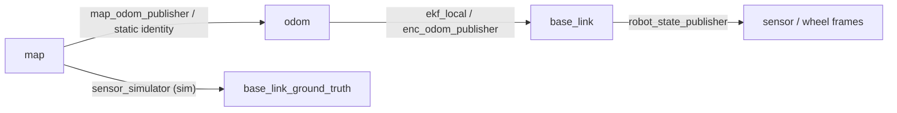

# bringup

Launch files and configuration for the navigation stack.

This README documents what crosses launch-file boundaries: the stack-wide topic names, which launch file produces and consumes them, and how the wiring changes per mode. Node interfaces (topic semantics, parameters, behavior) are documented in each package's README, linked throughout.

## Configurations

### Mode

There are three modes: `autonav`, `self_drive` and `nav_test`. They should be passed in with the `mode` flag. See the per-launch-file sections for what each mode changes.

### Course

To configure a new course, add a subfolder under `bringup/courses/` containing:

- `gps.json` - GPS datum and waypoints
- `map.json` - Simulation obstacle map

Courses can be generated using the [course creation tool](https://github.com/umigv/course_creation_tool). The `default` course is used when no `course` argument is provided. See `bringup/courses/default/` for the expected schema. Pass the subfolder name into launch files to select a course

### Frames

TF frame names are centralized in `config/frames.yaml` and injected into every node, so all launch files agree on frame names without repeating them.

## System Wiring

The diagram shows what crosses launch-file boundaries; the Topics table below it is the full node-level wiring, including topics internal to a launch file (per-node debug topics live in the package READMEs). Status-only consumers (led_driver's LED inputs, Foxglove) are omitted from the diagram. Topic names are the stack-wide (remapped) names. `a / b` means either fills that role depending on configuration (hardware vs simulation, or mode).

A topic is live in a mode exactly when its producer node runs in that mode - see each launch file's node table below for the node \<-> mode mapping. The one exception is `goal`, which switches producer: autonav_goal_selection in `autonav`, CV / the user in `self_drive` and `nav_test`.



### Topics

| Topic                         | From                                | To                                                                                             |
| ----------------------------- | ----------------------------------- | ---------------------------------------------------------------------------------------------- |
| `joy`                         | joy                                 | teleop_twist_joy                                                                               |
| `teleop_cmd_vel`              | teleop_twist_joy                    | twist_mux, led_driver                                                                          |
| `nav_cmd_vel`                 | path_tracking                       | twist_mux, led_driver                                                                          |
| `recovery_cmd_vel`            | recovery_behavior                   | twist_mux                                                                                      |
| `cmd_vel`                     | twist_mux                           | odrive_driver / sensor_simulator                                                               |
| `enc_vel/raw`                 | odrive_driver / sensor_simulator    | ekf_local / enc_odom_publisher                                                                 |
| `imu/raw`                     | vectornav_driver / sensor_simulator | ekf_local                                                                                      |
| `gps/raw`                     | vectornav_driver / sensor_simulator | gps_origin_calculator                                                                          |
| `ins_vel/raw`                 | vectornav_driver / sensor_simulator | (Unused)                                                                                       |
| `odom/global`                 | vectornav_driver / sensor_simulator | map_odom_publisher, autonav_mission_control                                                    |
| `odom/local`                  | ekf_local / enc_odom_publisher      | autonav_goal_selection, path_planning, path_tracking                                           |
| `occupancy_grid/raw`          | CV stack / occupancy_grid_simulator | occupancy_grid_transform                                                                       |
| `occupancy_grid/transformed`  | occupancy_grid_transform            | autonav_goal_selection                                                                         |
| `occupancy_grid/inflated`     | occupancy_grid_transform            | path_planning                                                                                  |
| `goal`                        | autonav_goal_selection / CV / User  | path_planning                                                                                  |
| `path`                        | path_planning                       | path_smoothing                                                                                 |
| `smoothed_path`               | path_smoothing                      | path_tracking                                                                                  |
| `mission_state`               | autonav_mission_control             | led_driver, occupancy_grid_transform, path_tracking, autonav_goal_selection, recovery_behavior |
| `odom/ground_truth`           | sensor_simulator                    | occupancy_grid_simulator, Foxglove                                                             |
| `occupancy_grid/ground_truth` | occupancy_grid_simulator            | Foxglove                                                                                       |

### TF

The robot's global pose is the composition of two independently maintained transforms: localization owns `odom` -> `base_link` (smooth, drifts), and `map` -> `odom` absorbs the global correction on top of it. Edge labels are the broadcasters; which one runs per mode is in the localization node table below.



### Services

| Service                                  | Server                  | Client                             | Modes     |
| ---------------------------------------- | ----------------------- | ---------------------------------- | --------- |
| `fromLL` (`robot_localization/FromLL`)   | lat_lon_converter       | autonav_mission_control at startup | `autonav` |
| `request_recovery` (`std_srvs/Trigger`)  | autonav_mission_control | autonav_goal_selection             | `autonav` |
| `recovery_complete` (`std_srvs/Trigger`) | autonav_mission_control | recovery_behavior                  | `autonav` |

### E-stop file

Besides topics, the e-stop state is wired through a file: [estop_driver](../hardware/estop_driver/README.md) writes it, [led_driver](../hardware/led_driver/README.md) and [odrive_driver](../hardware/odrive_driver/README.md) read it. The path is injected into all three as `estop_file_path`.

______________________________________________________________________

## gps_origin_calculator.launch.py

Records the GPS datum for a course into its `gps.json` - see [gps_origin_calculator](../localization/gps_origin_calculator/README.md) for how the datum is computed. Run this once with the robot stationary at the start position before an autonomous run; it shuts down automatically when done.

```bash
ros2 launch bringup gps_origin_calculator.launch.py [course:=<course>]
```

### Parameters

- `course`: Course profile in `courses/` whose `gps.json` will be updated, default `default`

______________________________________________________________________

## base.launch.py

Launches the base stack required for all operation modes: core, hardware (or simulation when `simulation:=true`), and localization.

```bash
ros2 launch bringup base.launch.py mode:=<mode> [simulation:=true] [course:=<course>]
```

### Parameters

- `mode`: Operation mode, passed through to hardware and localization (required)
- `simulation`: Use simulation instead of hardware sensors, default `false`
- `course`: Course profile, default `default` (required for `mode:=autonav` or `simulation:=true`)

______________________________________________________________________

## core.launch.py

Launches the mode-independent core: robot description and velocity multiplexing.

```bash
ros2 launch bringup core.launch.py
```

### Nodes

- `robot_state_publisher` - Publishes TF for all robot links from [maverick_description](../description/maverick_description/README.md) `urdf/maverick.xacro`
- `joint_state_publisher` - Publishes joint states for the URDF's movable joints
- `twist_mux` - Multiplexes the `*_cmd_vel` topics into `cmd_vel`

### Velocity Multiplexing

| Priority | Topic              | Source          | Timeout |
| -------- | ------------------ | --------------- | ------- |
| 3        | `teleop_cmd_vel`   | Joystick        | 0.5s    |
| 2        | `recovery_cmd_vel` | Recovery system | 0.5s    |
| 1        | `nav_cmd_vel`      | Autonomy        | 0.5s    |

If a higher-priority source stops publishing, control falls back to the next source after its timeout. Config in `config/core/twist_mux.yaml`.

______________________________________________________________________

## hardware.launch.py

Launches hardware drivers.

```bash
ros2 launch bringup hardware.launch.py mode:=<mode> [course:=<course>]
```

### Parameters

- `mode`: Operation mode (required)
- `course`: Course profile whose `gps.json` datum configures INS odometry, default `default` (required for `autonav`)

### Nodes per mode

| Node                                                       | `autonav`                              | `self_drive`                     | `nav_test` |
| ---------------------------------------------------------- | -------------------------------------- | -------------------------------- | ---------- |
| [estop_driver](../hardware/estop_driver/README.md)         | Y                                      | Y                                | Y          |
| [led_driver](../hardware/led_driver/README.md)             | Y                                      | Y                                | Y          |
| [odrive_driver](../hardware/odrive_driver/README.md)       | Y                                      | Y                                | Y          |
| [vectornav_driver](../hardware/vectornav_driver/README.md) | Y with `datum` (enables `odom/global`) | Y with `require_attitude: false` | -          |

______________________________________________________________________

## simulation.launch.py

Launches simulated replacements for the hardware sensors.

```bash
ros2 launch bringup simulation.launch.py [course:=<course>]
```

### Parameters

- `course`: Course profile to load the obstacle map (`map.json`) and GPS datum from, default `default`

### Nodes

- [sensor_simulator](../simulation/sensor_simulator/README.md)
- [occupancy_grid_simulator](../simulation/occupancy_grid_simulator/README.md)

______________________________________________________________________

## localization.launch.py

Launches localization.

```bash
ros2 launch bringup localization.launch.py mode:=<mode> [course:=<course>]
```

### Parameters

- `mode`: Operation mode (required)
- `course`: Course profile to load the GPS datum from, default `default` (required for `autonav`)

### Nodes per mode

| Node                                                               | Modes                    |
| ------------------------------------------------------------------ | ------------------------ |
| ekf_local                                                          | `autonav`, `self_drive`  |
| [enc_odom_publisher](../localization/enc_odom_publisher/README.md) | `nav_test`               |
| [map_odom_publisher](../localization/map_odom_publisher/README.md) | `autonav`                |
| static identity transform (`map` -> `odom`)                        | `self_drive`, `nav_test` |
| [lat_lon_converter](../localization/lat_lon_converter/README.md)   | `autonav`                |

`ekf_local` (`robot_localization/ekf_node`) fuses encoder vx/vy from `enc_vel/raw` with IMU yaw rate from `imu/raw`; config in `config/localization/ekf.yaml`.

______________________________________________________________________

## navigation.launch.py

Launches the navigation stack.

```bash
ros2 launch bringup navigation.launch.py mode:=<mode> [course:=<course>]
```

### Parameters

- `mode`: Operation mode (required)
- `course`: Course profile to load waypoints from, default `default` (required for `autonav`)

### Nodes per mode

| Node                                                                         | Modes     |
| ---------------------------------------------------------------------------- | --------- |
| [occupancy_grid_transform](../navigation/occupancy_grid_transform/README.md) | all       |
| [path_planning](../navigation/path_planning/README.md)                       | all       |
| [path_smoothing](../navigation/path_smoothing/README.md)                     | all       |
| [path_tracking](../navigation/path_tracking/README.md)                       | all       |
| [autonav_mission_control](../navigation/autonav_mission_control/README.md)   | `autonav` |
| [autonav_goal_selection](../navigation/autonav_goal_selection/README.md)     | `autonav` |
| [recovery_behavior](../navigation/recovery_behavior/README.md)               | `autonav` |

In `autonav`, the launch shuts down when mission control exits on mission completion.

______________________________________________________________________

## teleop.launch.py

Launches joystick teleoperation: `joy` plus `teleop_twist_joy` publishing `teleop_cmd_vel`.

```bash
ros2 launch bringup teleop.launch.py controller:=<controller>
```

### Parameters

- `controller`: Controller profile (`xbox`, `xbox_wireless`, `ps4`, or `ps4_wireless`), required

### Controller Mappings

For all controllers:

- Left joystick - Linear motion
- Right joystick - Turning
- Right shoulder button (RB / R1) - Enable
- Left shoulder button (LB / L1) - Turbo

______________________________________________________________________

## visualization.launch.py

Launches visualization tools for Foxglove Studio.

```bash
ros2 launch bringup visualization.launch.py
```

### Nodes

- `foxglove_bridge` - Foxglove bridge on `ws://localhost:8765`
- [occupancy_grid_visualization](../visualization/occupancy_grid_visualization/README.md)

### RViz

We maintain a shared RViz configuration in `config/visualization/maverick.rviz`. The ground truth map, inflated occupancy grid, local odometry, paths, and goal displays are enabled by default. The raw and transformed occupancy grids and the global and ground truth odometry are included but toggled off to avoid overdraw - enable them from the Displays panel as needed.
